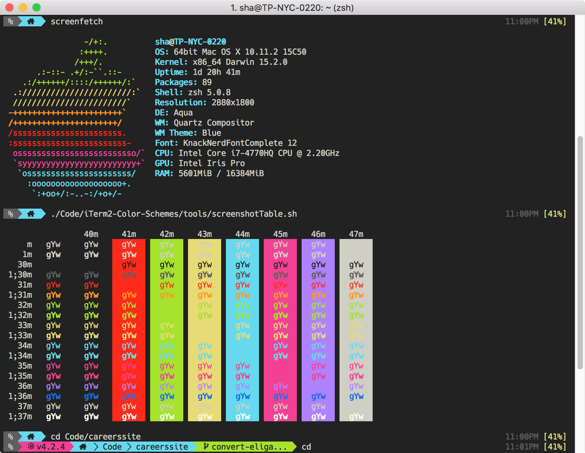

# zsh-snarf
Snarf theme for [Oh-My-Zsh](http://ohmyz.sh/). Requires the `battery` and `jsontools` plugins.

### Installation
```bash
sh -c "$(wget https://raw.github.com/spencerhakim/zsh-snarf/master/install.sh -O -)"
```

This will not modify any settings; it only simplifies installation. It places the font and .zsh-theme in the appropriate
directories, and imports the iTerm2 preset. You are still required to switch to these files manually.

### Screenshot

(Snarf theme, with Monokai Snarf iTerm2 colorscheme, and Knack typeface AKA Nerd Font-patched Hack typeface)
